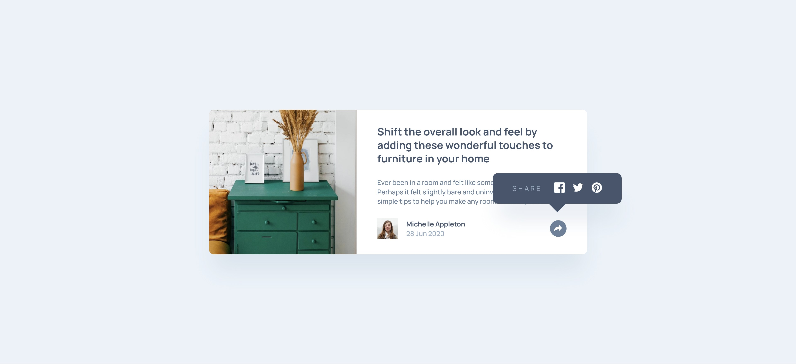

# Frontend Mentor - Article Preview Component

## Table of contents

- [Overview](#overview)
  - [The challenge](#the-challenge)
  - [Screenshot](#screenshot)
  - [Live preview](#live-preview)
  - [Solution retrospective](#solution-retrospective)

## Overview

### The challenge

The challenge was to build out an article preview component with JavaScript (and of course, get it looking as close to the design as possible).

### Screenshot

### Live preview

- Live Site URL: [Live preview](https://marioncts.github.io/Article-Preview-Component/)

### Solution retrospective

This is my initial solution using JavaScript. While I recognize there is much to learn, I took the initiative to develop this solution based on my current knowledge. Additionally, I employed Sass for the second time; although I am gradually mastering its features, I acknowledge that there is still room for improvement in writing cleaner and more efficient code.

Any feedback would be greatly appreciated!